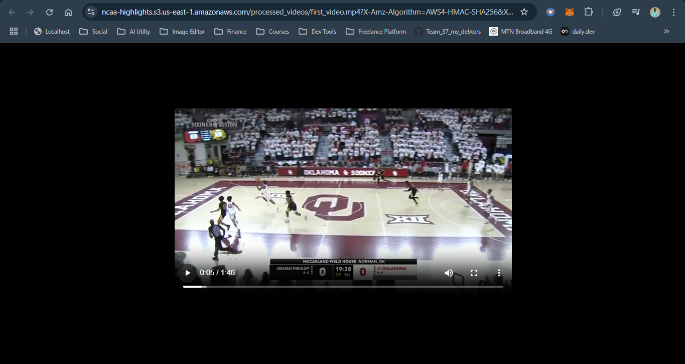

# NCAA Game Highlights
**Project Overview:** This project uses RapidAPI to obtain NCAA game highlights using a Docker container and AWS Media Convert to convert the media file.


## File Overview
- **config.py script:** Imports necessary environment variables and assigns them to Python variables, providing default values where appropriate.
- **fetch.py script:** This will fetch the highlights from the API according to the date and league then store them in an S3 bucket as a JSON file (basketball_highlight.json)
- **process_one_video.py:** Connects to the S3 bucket and retrieves the JSON file to extract and download the first video URL from within the JSON file then saves the video in the S3 bucket under a different folder (videos/) 
- **mediaconvert_process.py:** Uses MediaConvert to process a video file - configures the video codec, resolution, and bitrate and also the audio settings then stores the processed video back into an S3 bucket
- **run_all.py:** Runs the scripts in chronological order and provides buffer time for the tasks to be created.
- **Dockerfile:** Provides the step-by-step approach to building the image.
- **Terraform Scripts:** Create resources in AWS like S3, IAM user roles, elastic registry service, and elastic container services in a scalable and repeatable way.

## Prerequisites
Before running the scripts, ensure you have the following:
1. **Create Rapidapi Account**
  - Rapidapi.com account, will be needed to access highlight images and videos.
  - [Sports Highlights API](https://rapidapi.com/highlightly-api-highlightly-api-default/api/sport-highlights-api/playground/apiendpoint_16dd5813-39c6-43f0-aebe-11f891fe5149) is the endpoint we will be using 

2. **Verify prerequisites are installed**
  - Docker should be pre-installed in most regions docker --version
  - AWS CLI pre-installed aws --version
  - Python3 should be pre-installed also python3 --version

3. **Retrieve AWS Account ID**
  - Copy your AWS Account ID Once logged in to the AWS Management Console

4. **Retrieve Access Keys and Secret Access Keys**
  - Create an access key if you do not have an existing access key in the IAM dashboard
Under Users

## Part 1: Step-by-Step Procedure (Local)
1. **Clone The Repo**
  ```bash
  git clone https://github.com/PeterOyelegbin/ncaa-game-highlights.git
  cd /src
  ```

2. **Add API Key to AWS Secrets Manager**
  ```bash
  aws secretsmanager create-secret \
      --name my-api-key \
      --description "API key for accessing the Sport Highlights API" \
      --secret-string '{"api_key":"YOUR_ACTUAL_API_KEY"}' \
      --region us-east-1
  ```

3. **Create an IAM role or user**
  - In the search bar type "IAM" -> Click Roles -> Create Role
  - For the Use Case enter "S3" and click next
  - Under Add Permission search for AmazonS3FullAccess, MediaConvertFullAccess and AmazonEC2ContainerRegistryFullAccess and click next
  - Under Role Details, enter "HighlightProcessorRole" as the name and select Create Role

4. **Update Trust relationships**
  - Find the role in the list and click on it
  - Under Trust relationships
  - Edit the Trust Policy and replace it with this:
  ```bash
  {
    "Version": "2012-10-17",
    "Statement": [
      {
        "Effect": "Allow",
        "Principal": {
          "Service": [
            "ec2.amazonaws.com",
            "ecs-tasks.amazonaws.com",
            "mediaconvert.amazonaws.com"
          ],
          "AWS": "arn:aws:iam::<"your-account-id">:user/<"your-iam-user">"
        },
        "Action": "sts:AssumeRole"
      }
    ]
  }
  ```

5. **Create .env file**
  ```bash
  API_URL=https://sport-highlights-api.p.rapidapi.com/basketball/highlights
  RAPIDAPI_HOST=sport-highlights-api.p.rapidapi.com
  RAPIDAPI_KEY=your_rapidapi_key_here
  AWS_ACCESS_KEY_ID=your_aws_access_key_id_here
  AWS_SECRET_ACCESS_KEY=your_aws_secret_access_key_here
  AWS_DEFAULT_REGION=us-east-1
  S3_BUCKET_NAME=your_S3_bucket_name_here
  AWS_REGION=us-east-1
  DATE=2023-12-01
  LEAGUE_NAME=NCAA
  LIMIT=5
  MEDIACONVERT_ENDPOINT=https://your_mediaconvert_endpoint_here.amazonaws.com
  MEDIACONVERT_ROLE_ARN=arn:aws:iam::your_account_id:role/HighlightProcessorRole
  INPUT_KEY=highlights/basketball_highlights.json
  OUTPUT_KEY=videos/first_video.mp4
  RETRY_COUNT=3
  RETRY_DELAY=30
  WAIT_TIME_BETWEEN_SCRIPTS=60
  ```

  - To get MEDIACONVERT_ENDPOINT
    ```bash
    aws mediaconvert describe-endpoints
    ```

6. **Secure .env file**
```bash
chmod 600 .env
```

7. **Locally Build & Run The Docker Container**
Run:
```bash
docker build -t highlight-processor .
```


8. **Run the Docker Container Locally**
```bash
docker run --env-file .env highlight-processor
```


9. **Confirm objects are saved in your S3 bucket**


10. **Confirm there is a video uploaded to s3://<your-bucket-name>/videos/**


11. **Confirm there is a video uploaded to s3://<your-bucket-name>/processed_videos/**


12. **Play the processed video**


### What I Learned
1. Working with Docker and AWS Services
2. Identity Access Management (IAM) and least privilege
3. How to enhance media quality 

### Future Enhancements
1. Using Terraform to enhance the Infrastructure as Code (IaC)
2. Increasing the amount of videos processed and converted with AWS Media Convert
3. Change the date from static (specific point in time) to dynamic (now, last 30 days from today's date, etc)

### Conclusion
This project demonstrates my hands-on approach to delivering an event-driven architecture using AWS services and APIs. By following this guide, you can set up and customize the system to meet your requirements.

---

## Part 2: Step-by-Step Procedure (Terraform)

### **Setup terraform.tfvars File**
1. In the GitHub repo, there is a resources folder and copy the entire contents
2. In the AWS Cloudshell or vs code terminal, create the file vpc_setup.sh and paste the script inside.
3. Run the script
```bash
bash vpc_setup.sh
```
4. You will see variables in the output, paste these variables into lines 8-13.
5. Store your API key in AWS Secrets Manager
```bash
aws ssm put-parameter \
  --name "/myproject/rapidapi_key" \
  --value "YOUR_SECRET_KEY" \
  --type SecureString
```
6.  Run the following script to obtain your mediaconvert_endpoint:
```bash
aws mediaconvert describe-endpoints --query "Endpoints[0].Url" --output text
```
7. Leave the mediaconvert_role_arn string empty

Helpful Tip for Beginners:
1. Use the same region, project, S3 Bucketname, and ECR Repo name to make following along easier. Certain steps like pushing the docker image to the ECR repo are easier to copy and paste without remembering what you named your repo :)

### **Run The Project**
1.  Navigate to the terraform folder/workspace in VS Code
From the src folder
```bash
cd terraform
```
2. Initialize Terraform working directory
```bash
terraform init
```
3. Check the syntax and validity of your Terraform configuration files
```bash
terraform validate
```
4. Display the execution plan for the terraform configuration
```bash
terraform plan
```
5. Apply changes to the desired state
```bash
terraform apply -var-file="terraform.dev.tfvars"
```

6. Create an ECR Repo
```bash
aws ecr create-repository --repository-name highlight-pipeline
```

7. Log into ECR
```bash
aws ecr get-login-password --region us-east-1 | \
  docker login --username AWS --password-stdin <AWS_ACCOUNT_ID>.dkr.ecr.us-east-1.amazonaws.com
```
8. Build and Push the Docker Image
```bash
docker build -t highlight-pipeline:latest .
docker tag highlight-pipeline:latest <AWS_ACCOUNT_ID>.dkr.ecr.<REGION>.amazonaws.com/highlight-pipeline:latest
```

```bash
docker push <AWS_ACCOUNT_ID>.dkr.ecr.<REGION>.amazonaws.com/highlight-pipeline:latest
```

### **Destroy ECS and ECR resources**
1. In the AWS Cloudshell or vs code terminal, create the file ncaaprojectcleanup.sh and paste the script inside from the resources folder.
3. Run the script
```bash
bash ncaaprojectcleanup.sh
```
### **Review Video Files**
1. Navigate to the S3 Bucket and confirm there is a JSON video in the highlights folder and a video in the videos folder

### **What We Learned**
1. Deploying local docker images to ECR 
2. A high-level overview of terraform files
3. Networking - VPCs, Internet Gateways, private subnets and public subnets
4. SSM for saving secrets and pulling into terraform

### **Future Enhancements**
1. Automating the creation of VPCs/networking infra, media endpoint
